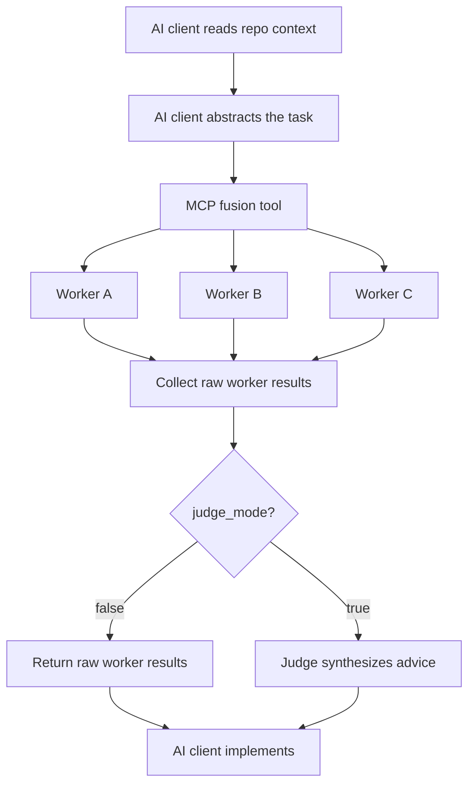

<p align="right">
  <a href="./README.md">English</a> | <a href="./README_ZH.md">中文</a>
</p>

# OpenFusion

OpenFusion is an MCP-first multi-model advisory engine. It fans an abstract,
self-contained task out to multiple worker models, returns their raw opinions,
and can optionally ask a judge model to synthesize the strongest answer.

OpenFusion doesn't scan your repository, mount a filesystem, execute tools, or
serve HTTP API endpoints. The AI client reads project context, abstracts the
task, calls the OpenFusion MCP tools, and implements the final changes.

## Quick start

```bash
cargo install --path .
openfusion --config ~/.openfusion/config.toml
```

Register OpenFusion as an MCP server in your AI client:

```json
{
  "mcpServers": {
    "openfusion": {
      "command": "openfusion",
      "args": ["--config", "/home/user/.openfusion/config.toml"]
    }
  }
}
```

## Features

| Feature | Description |
|---|---|
| **MCP-first interface** | Runs over MCP stdio; no HTTP gateway mode. |
| **Worker fanout** | Sends the same abstract task to multiple configured workers in parallel. |
| **Optional judge** | `fusion` can return raw worker results or judge-synthesized advice. |
| **Protocol conversion** | Calls OpenAI Chat Completions, OpenAI Responses, Google GenAI, and Anthropic Messages upstream APIs. |
| **Session archive** | Stores fusion sessions and supports list, get, export, delete, and replay. |
| **Diff and bench tools** | Provides raw worker comparison and measurable profile benchmarking helpers. |
| **Fault tolerance** | Uses retry settings and a `min_workers` threshold for partial worker failure. |

## MCP tools

| Tool | Description |
|---|---|
| `fusion` | Sends an abstract, project-independent task to workers. Set `judge_mode` to enable judge synthesis. |
| `fusion_diff` | Queries workers and returns raw responses plus measurable metadata. It does not infer semantic consensus or disagreement. |
| `fusion_bench` | Runs the same prompt across multiple fusion profiles and reports success rate, cost, and latency. It does not score answer quality. |
| `fusion_session` | Manages archived sessions: `list`, `get`, `export`, `delete`, and `replay`. Replay preserves the archived judge mode and worker panel when possible. |

## Configuration

`~/.openfusion/config.toml` is created on first run if it doesn't exist.

```toml
[fusion]
name = "openfusion/fusion"
timeout_secs = 120
worker_timeout_secs = 60
min_workers = 1
retry = 0

[judge]
base_url = "https://api.openai.com"
api = "openai-responses"
api_key = "sk-xxx"
model = "gpt-5.4-mini"

[[workers]]
base_url = "https://api.openai.com"
api = "openai-responses"
api_key = "sk-xxx"
model = "gpt-5.4-mini"
name = "analytical"
personality = ["rational", "logical"]

[[workers]]
base_url = "https://api.anthropic.com"
api = "anthropic-messages"
api_key = "sk-xxx"
model = "claude-sonnet-4.6"
name = "critical"
personality = ["strict", "critical"]

[storage]
max_sessions = 1000
```

API key priority: endpoint config, then `OPENFUSION_API_KEY`.

## How it works



The worker prompt tells models that they don't have access to the user's real
filesystem, shell, browser, or tools. The calling AI client owns repository
inspection and implementation.

## Build

```bash
cargo build
cargo build --release
cargo test
```

## Tech stack

Rust 2024 · tokio · reqwest · rmcp · serde · toml
