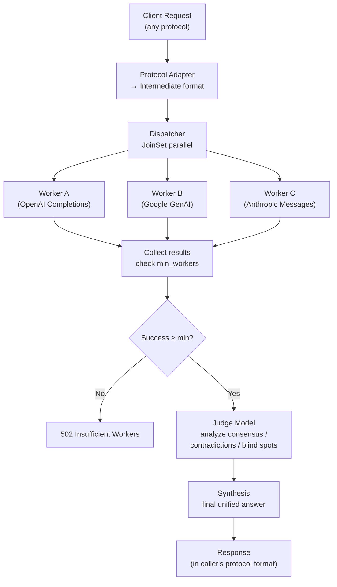

<p align="right">
  <a href="./README.md">English</a> | <a href="./README_ZH.md">中文</a>
</p>

# OpenFusion

Universal multi-model fusion gateway — dispatch one request to multiple AI models in parallel, then a judge model analyzes consensus, contradictions, and blind spots to synthesize the optimal answer. Exposes four industry-standard API endpoints so any AI tool can connect directly.

## Quick Start

```bash
# Install
cargo install --path .

# First run auto-generates ~/.openfusion/config.toml
openfusion

# Edit config, fill in your API keys
# ~/.openfusion/config.toml

# Start the server
openfusion

# Test
curl -X POST http://127.0.0.1:9999/v1/chat/completions \
  -H "Content-Type: application/json" \
  -d '{
    "model": "openrouter/fusion",
    "messages": [{"role": "user", "content": "Rust vs Zig for systems programming?"}]
  }'
```

You'll get a synthesized answer — panel models respond in parallel, then the judge model compares and produces the best combined output.

## Features

| Feature | Description |
|---|---|
| **HTTP Gateway** | Four protocol endpoints: OpenAI Chat Completions / OpenAI Responses / Google Generative AI / Anthropic Messages |
| **Fusion Engine** | JoinSet parallel dispatch → judge synthesis → structured analysis (consensus, contradictions, blind spots) |
| **Web Capabilities** | Each worker can inject `web_search` / `web_fetch` plugins |
| **Cost Tracking** | Parses `x-openrouter-cost` response header for precise per-fusion billing |
| **Session Archive** | JSONL persistence with list/replay/markdown export |
| **MCP Integration** | Three tools: `fusion_diff` / `fusion_bench` / `fusion_session` |
| **Fault Tolerance** | Configurable retry + partial worker failure OK + min_workers threshold |
| **Concurrency Limit** | tower `ConcurrencyLimitLayer` caps max concurrent requests |

## HTTP Endpoints

| Method | Path | Protocol |
|---|---|---|
| `POST` | `/v1/chat/completions` | OpenAI Chat Completions |
| `POST` | `/v1/responses` | OpenAI Responses |
| `POST` | `/v1/google/{*path}` | Google Generative AI |
| `POST` | `/v1/messages` | Anthropic Messages |
| `GET` | `/health` | Health check |
| `GET` | `/metrics` | Runtime metrics |

**Google GenAI example:**

```bash
curl -X POST "http://127.0.0.1:9999/v1/google/models/gemini-2.5-flash:generateContent" \
  -H "Content-Type: application/json" \
  -d '{
    "contents": [{"role": "user", "parts": [{"text": "Explain quantum computing in one paragraph."}]}],
    "generationConfig": {"max_output_tokens": 1024}
  }'
```

**Anthropic Messages example:**

```bash
curl -X POST http://127.0.0.1:9999/v1/messages \
  -H "Content-Type: application/json" \
  -d '{
    "model": "claude-sonnet-4-20250514",
    "max_tokens": 1024,
    "messages": [{"role": "user", "content": "Hello, world."}]
  }'
```

## Configuration

`~/.openfusion/config.toml` (auto-generated on first run):

```toml
[server]
port = 9999
host = "127.0.0.1"
max_concurrent_requests = 10

[fusion]
name = "openrouter/fusion"
timeout_secs = 120
worker_timeout_secs = 60
min_workers = 1       # minimum successful workers; returns 502 if not met
retry = 0             # retry count for 5xx errors

[judge]
base_url = "https://api.openai.com"
api = "openai-completions"              # openai-completions | openai-responses | google-generative-ai | anthropic-messages
api_key = "sk-xxx"
model = "deepseek-v4-pro"

[[workers]]
base_url = "https://api.openai.com"
api = "openai-responses"
api_key = "sk-xxx"
model = "gpt-5.5"

[[workers]]
base_url = "https://generativelanguage.googleapis.com"
api = "google-generative-ai"
api_key = "sk-xxx"
model = "gemini-3.5-flash"

[storage]
max_sessions = 1000
```

**API Key priority:** request body `api_key` → env var `OPENFUSION_API_KEY` → config file

## MCP Integration

Register as an MCP server in Claude Code:

```json
{
  "mcpServers": {
    "openfusion": {
      "command": "openfusion",
      "args": ["--mcp", "--config", "/home/user/.openfusion/config.toml"]
    }
  }
}
```

Three MCP tools:

| Tool | Description |
|---|---|
| `fusion_diff` | Query all workers in parallel, return raw responses + structured comparison matrix (common points, unique insights, disagreements, blind spots, best-by-aspect). No synthesis — Claude Code acts as judge. |
| `fusion_bench` | Run the same prompt across multiple config profiles, returning cost/quality/latency comparison and rankings. |
| `fusion_session` | Session archive management. Actions: `list` / `get` / `export` / `delete` / `replay`. |

## CLI Flags

```bash
openfusion                        # HTTP mode (default)
openfusion --mcp                  # MCP-only mode (stdio transport)
openfusion --config /path/to/cfg  # Custom config path
openfusion --config /path --mcp   # MCP + custom config
```

## How It Works



Each worker calls models via **OpenRouter**, with optional `web_search`/`web_fetch` plugin injection. The judge performs structured analysis on all responses — no concatenation, no majority vote.

## Build

```bash
cargo build              # debug build
cargo build --release    # optimized release build
cargo clippy             # lint check
```

## Tech Stack

Rust 2024 · tokio · axum · reqwest · imara-diff · rmcp · tower · serde · toml
