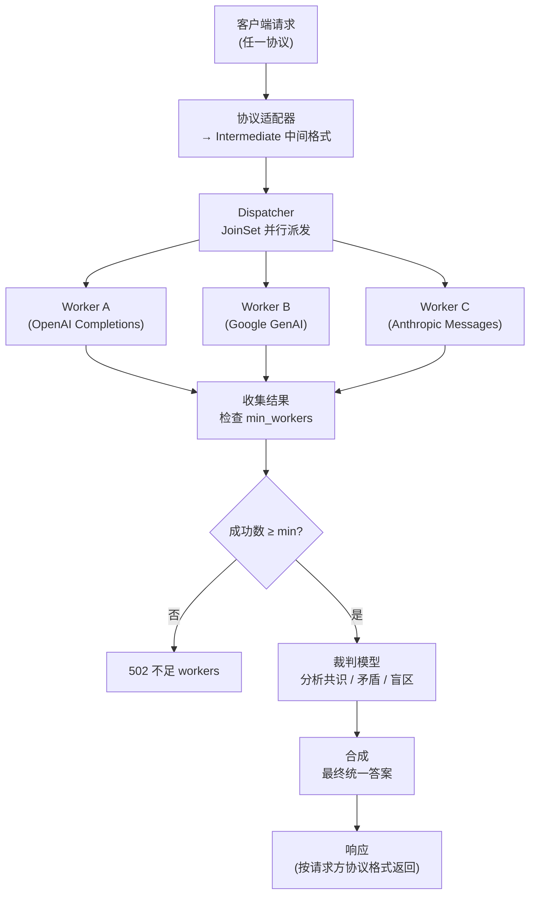

<p align="right">
  <a href="./README.md">English</a> | <a href="./README_ZH.md">中文</a>
</p>

# OpenFusion

通用多模型融合网关——一条请求并行发给多个 AI 模型，裁判模型分析共识、矛盾、盲区后合成最优答案。同时暴露四套业界协议端点，任何 AI 工具均可直连。

## 快速开始

```bash
# 安装
cargo install --path .

# 首次运行自动生成 ~/.openfusion/config.toml
openfusion

# 编辑配置，填入 API key
# ~/.openfusion/config.toml

# 启动服务
openfusion

# 测试
curl -X POST http://127.0.0.1:9999/v1/chat/completions \
  -H "Content-Type: application/json" \
  -d '{
    "model": "openrouter/fusion",
    "messages": [{"role": "user", "content": "Rust vs Zig 在系统编程场景的优劣？"}]
  }'
```

返回融合后的合成答案——面板模型并行作答，裁判模型综合评判后输出最优结果。

## 功能

| 模块 | 说明 |
|---|---|
| **HTTP 网关** | 四协议端点：OpenAI Chat Completions / OpenAI Responses / Google Generative AI / Anthropic Messages |
| **融合引擎** | JoinSet 并行派发 → 裁判合成 → 结构化分析（共识、矛盾、盲区） |
| **联网能力** | 每个 worker 可注入 `web_search` / `web_fetch` 插件 |
| **Cost 追踪** | 解析 `x-openrouter-cost` 响应头，每次融合精确计费 |
| **Session 存档** | JSONL 持久化，支持列表、回放、导出 Markdown |
| **MCP 集成** | `fusion_diff` / `fusion_bench` / `fusion_session` 三个工具 |
| **容错机制** | 可配置 retry + 部分 worker 失败不中断 + min_workers 门槛 |
| **并发限流** | tower `ConcurrencyLimitLayer` 控制最大并发请求数 |

## HTTP 端点

| 方法 | 路径 | 协议 |
|---|---|---|
| `POST` | `/v1/chat/completions` | OpenAI Chat Completions |
| `POST` | `/v1/responses` | OpenAI Responses |
| `POST` | `/v1/google/{*path}` | Google Generative AI |
| `POST` | `/v1/messages` | Anthropic Messages |
| `GET` | `/health` | 健康检查 |
| `GET` | `/metrics` | 运行时指标 |

**Google GenAI 调用示例：**

```bash
curl -X POST "http://127.0.0.1:9999/v1/google/models/gemini-2.5-flash:generateContent" \
  -H "Content-Type: application/json" \
  -d '{
    "contents": [{"role": "user", "parts": [{"text": "用一句话解释量子计算。"}]}],
    "generationConfig": {"max_output_tokens": 1024}
  }'
```

**Anthropic Messages 调用示例：**

```bash
curl -X POST http://127.0.0.1:9999/v1/messages \
  -H "Content-Type: application/json" \
  -d '{
    "model": "claude-sonnet-4-20250514",
    "max_tokens": 1024,
    "messages": [{"role": "user", "content": "你好。"}]
  }'
```

## 配置文件

`~/.openfusion/config.toml`（首次运行自动生成）：

```toml
[server]
port = 9999
host = "127.0.0.1"
max_concurrent_requests = 10

[fusion]
name = "openrouter/fusion"
timeout_secs = 120
worker_timeout_secs = 60
min_workers = 1       # 最少成功 worker 数，不满足则返回 502
retry = 0             # 5xx 错误重试次数

[judge]
base_url = "https://api.openai.com"
api = "openai-completions"              # openai-completions | openai-responses | google-generative-ai | anthropic-messages
api_key = "sk-xxx"
model = "deepseek-v4-pro"

[[workers]]
base_url = "https://api.openai.com"
api = "openai-responses"
api_key = "sk-xxx"
model = "gpt-5.5"

[[workers]]
base_url = "https://generativelanguage.googleapis.com"
api = "google-generative-ai"
api_key = "sk-xxx"
model = "gemini-3.5-flash"

[storage]
max_sessions = 1000
```

**API Key 优先级：** 请求体 `api_key` → 环境变量 `OPENFUSION_API_KEY` → 配置文件

## MCP 集成

在 Claude Code 中注册为 MCP 服务器：

```json
{
  "mcpServers": {
    "openfusion": {
      "command": "openfusion",
      "args": ["--mcp", "--config", "/home/user/.openfusion/config.toml"]
    }
  }
}
```

三个 MCP 工具：

| 工具 | 说明 |
|---|---|
| `fusion_diff` | 并行查询所有 worker，返回各模型原始回复 + 结构化对比矩阵（共识点、独到见解、矛盾、盲区、各维度最佳）。不做合成，Claude 自己当裁判。 |
| `fusion_bench` | 同一 prompt 跑多组配置，输出成本/质量/延迟对比矩阵和排名。 |
| `fusion_session` | 融合会话存档管理。action: `list` / `get` / `export` / `delete` / `replay`。 |

## 启动参数

```bash
openfusion                        # HTTP 模式（默认）
openfusion --mcp                  # MCP-only 模式（stdio 传输）
openfusion --config /path/to/cfg  # 指定配置文件
openfusion --config /path --mcp   # MCP 模式 + 指定配置
```

## 工作原理



每个 worker 通过 **OpenRouter** 调用，自动注入 `web_search`/`web_fetch` 插件。裁判模型对所有回复做结构化分析，不合并拼接，不取多数票。

## 构建

```bash
cargo build              # 开发构建
cargo build --release    # 发布构建（优化体积和速度）
cargo clippy             # 代码检查
```

## 技术栈

Rust 2024 · tokio · axum · reqwest · imara-diff · rmcp · tower · serde · toml
