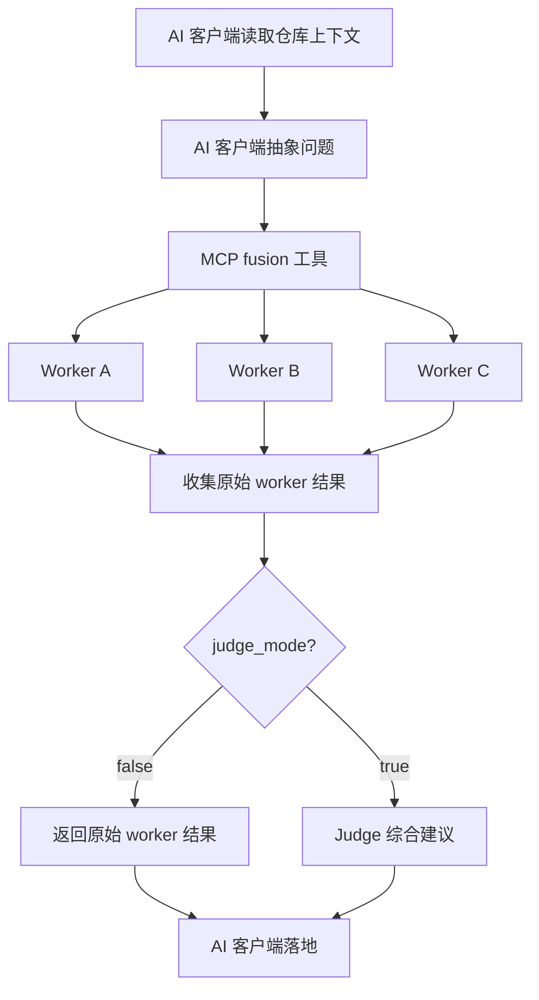

<p align="right">
  <a href="./README.md">English</a> | <a href="./README_ZH.md">中文</a>
</p>

# OpenFusion

OpenFusion 是一个 MCP-first 的多模型咨询引擎。它把一个抽象、自包含的
任务并发下发给多个 worker 模型，返回原始意见，并且可以选择让 judge
模型综合出更凝练的建议。

OpenFusion 不扫描你的仓库，不挂载文件系统，不执行工具，也不提供 HTTP
API 端点。AI 客户端负责读取项目上下文、抽象问题、调用 OpenFusion MCP
工具，并最终落地修改。

## 快速开始

```bash
cargo install --path .
openfusion --config ~/.openfusion/config.toml
```

在 AI 客户端中注册 MCP server：

```json
{
  "mcpServers": {
    "openfusion": {
      "command": "openfusion",
      "args": ["--config", "/home/user/.openfusion/config.toml"]
    }
  }
}
```

## 功能

| 功能 | 说明 |
|---|---|
| **MCP-first 接口** | 通过 MCP stdio 运行，不再提供 HTTP gateway 模式。 |
| **Worker 并发分发** | 将同一个抽象任务并发发送给多个配置的 worker。 |
| **可选 judge** | `fusion` 可以返回原始 worker 结果，也可以启用 judge 综合。 |
| **协议转换** | 上游支持 OpenAI Chat Completions、OpenAI Responses、Google GenAI、Anthropic Messages。 |
| **Session 存档** | 支持 session 的 list、get、export、delete、replay。 |
| **Diff 和 bench 工具** | 提供原始 worker 对比和可度量的 profile 基准测试。 |
| **容错** | 支持 retry 配置和 `min_workers` 阈值。 |

## MCP 工具

| 工具 | 说明 |
|---|---|
| `fusion` | 将抽象、项目无关的任务发送给 workers。设置 `judge_mode` 启用 judge 综合。 |
| `fusion_diff` | 查询 workers，返回原始回复和可度量元数据，不推断语义共识或分歧。 |
| `fusion_bench` | 使用同一个 prompt 运行多个 fusion profile，返回成功率、成本和延迟，不评价答案质量。 |
| `fusion_session` | 管理归档 session：`list`、`get`、`export`、`delete`、`replay`。Replay 会尽量保留归档时的 judge 模式和 worker panel。 |

## 配置

如果配置文件不存在，首次运行会创建 `~/.openfusion/config.toml`。

```toml
[fusion]
name = "openfusion/fusion"
timeout_secs = 120
worker_timeout_secs = 60
min_workers = 1
retry = 0

[judge]
base_url = "https://api.openai.com"
api = "openai-responses"
api_key = "sk-xxx"
model = "gpt-5.4-mini"

[[workers]]
base_url = "https://api.openai.com"
api = "openai-responses"
api_key = "sk-xxx"
model = "gpt-5.4-mini"
name = "analytical"
personality = ["rational", "logical"]

[[workers]]
base_url = "https://api.anthropic.com"
api = "anthropic-messages"
api_key = "sk-xxx"
model = "claude-sonnet-4.6"
name = "critical"
personality = ["strict", "critical"]

[storage]
max_sessions = 1000
```

API key 优先级：endpoint 配置，然后是 `OPENFUSION_API_KEY`。

## 工作方式



Worker prompt 会明确告诉模型：它们不能访问用户真实文件系统、shell、
浏览器或工具。仓库检查和实现都由调用 OpenFusion 的 AI 客户端负责。

## 构建

```bash
cargo build
cargo build --release
cargo test
```

## 技术栈

Rust 2024 · tokio · reqwest · rmcp · serde · toml
